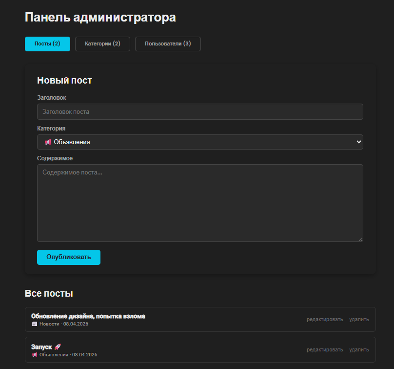
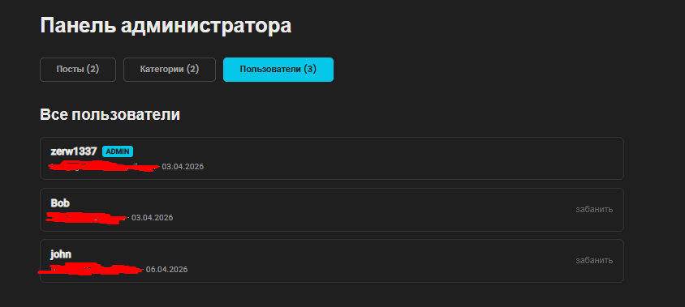
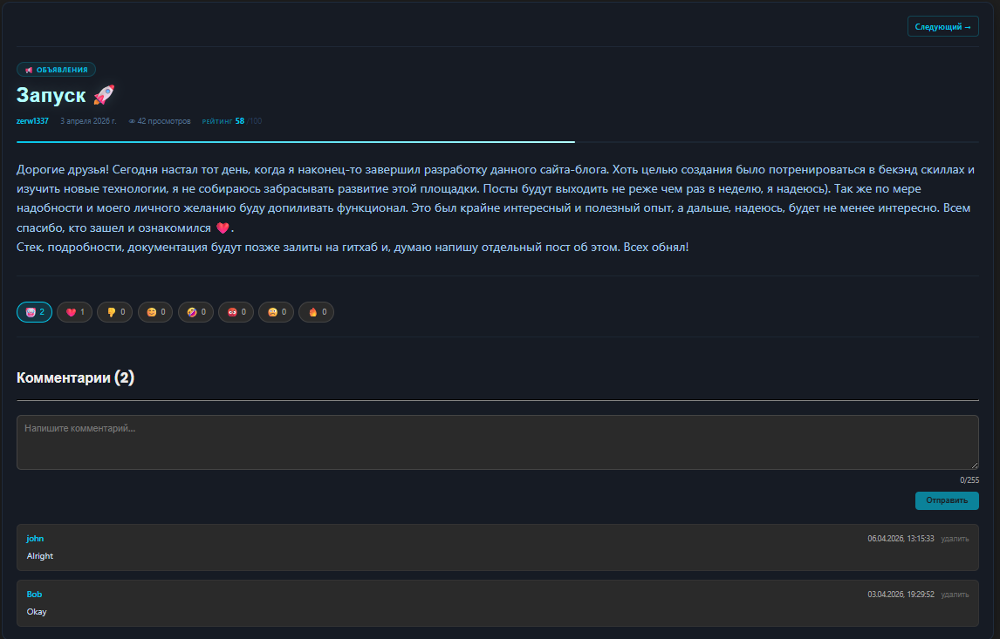
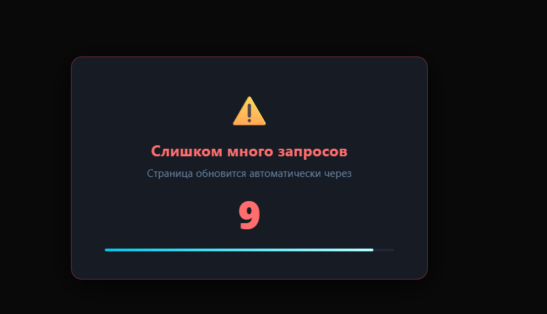
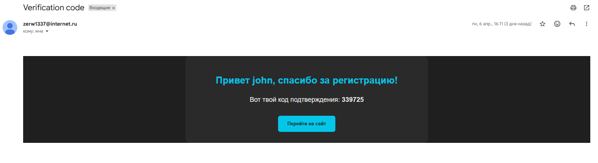
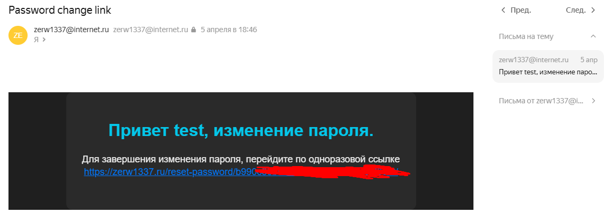

# my-simple-website

Минималистичный веб-сайт с полноценной backend-логикой: пользователи, блог, система реакций и защита API.
Фронтенд реализован для демонстрации возможностей API. \
[Задеплоенный проект](https://zerw1337.ru)

---

## 🚀 Функционал

- 🔐 Аутентификация по JWT (RS256)  
- 👤 Система пользователей с профилями
- 
- ⚡ Система суперпользователя для управления
- 
- 

### 📝 Блог
- категории  
- посты  
- комментарии
- 

### ❤️ Реакции
- лайки и другие типы реакций  

### ⭐ Рейтинг
- простая система рейтинга  

- 

### ⛔ Rate limiting
- комментарии  
- реакции  
- смена пароля  
- email  
- общее количество запросов
- 

### ⚡ Redis
- кеширование  
- хранение rate limits  

### 📧 Email
- SMTP сервис для отправки писем
- 
- 

## 🛠 Стек
- Backend: Python (FastAPI)
- Frontend: React, Vite
- Database: PostgreSQL (asyncpg), Alembic
- Validation: pydantic
- Cache & Rate Limit: Redis
- Auth: JWT (RS256)
- Email: SMTP (aiosmtplib)
- Deploy: Nginx, Docker
- Tests: Pytest

## ⛩️ Архитектура
### Монолитное REST API, разделенное по слоям
Request → Route → DTO validation → Service → ORM → Response DTO → Response

### Дополнительно
- Alembic миграции
- Обработка ошибок
- Транзакции

## 📖 Docs
Локально при запуске dev версии
- http://127.0.0.1:8000/docs  

Задеплоенная версия
- https://zerw1337.ru/api/docs

## ⚙️ Установка и запуск
### Клонирование
git clone https://github.com/zerw1337/my-simple-website.git  
cd my-simple-website
### Генерация сертификатов
mkdir certs   
cd my-simple-website/certs   
openssl genpkey -algorithm RSA -out private.pem -pkeyopt rsa_keygen_bits:2048  
openssl rsa -pubout -in private.pem -out public.pem 
### .env
cd ..  
(необходимо так же одинаковые создать .env файлы в /my-simple-website и /my-simple-website/backend и заполнить их согласно .env-example)
### Запуск
#### dev (local)
docker compose -f docker-compose.dev.yml up --build --watch 
#### test
docker compose -f docker-compose.test.yml up --build  
cd backend  
pytest -v 
#### deploy (нужен ssl сертификат)
docker compose -f docker-compose.yml up -d