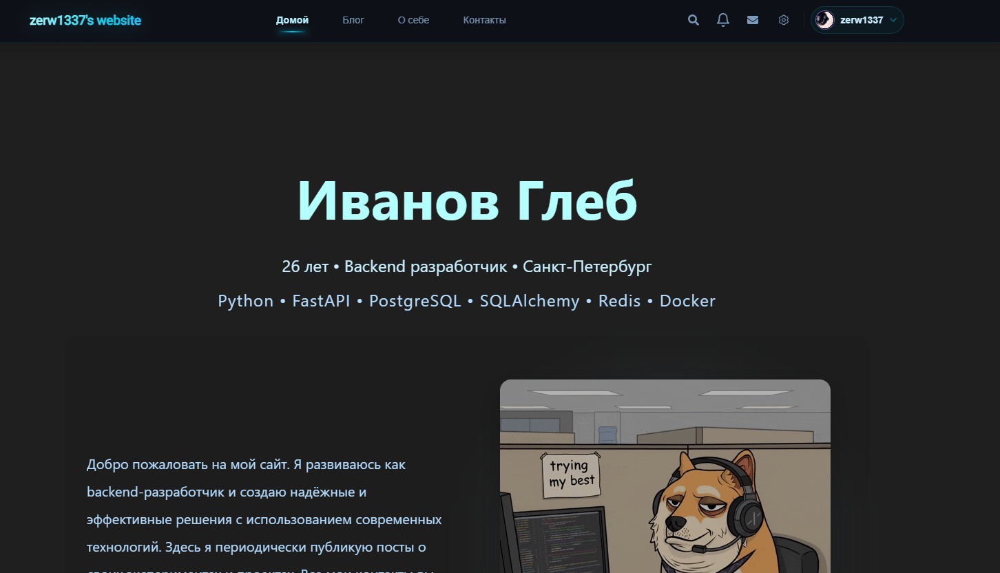
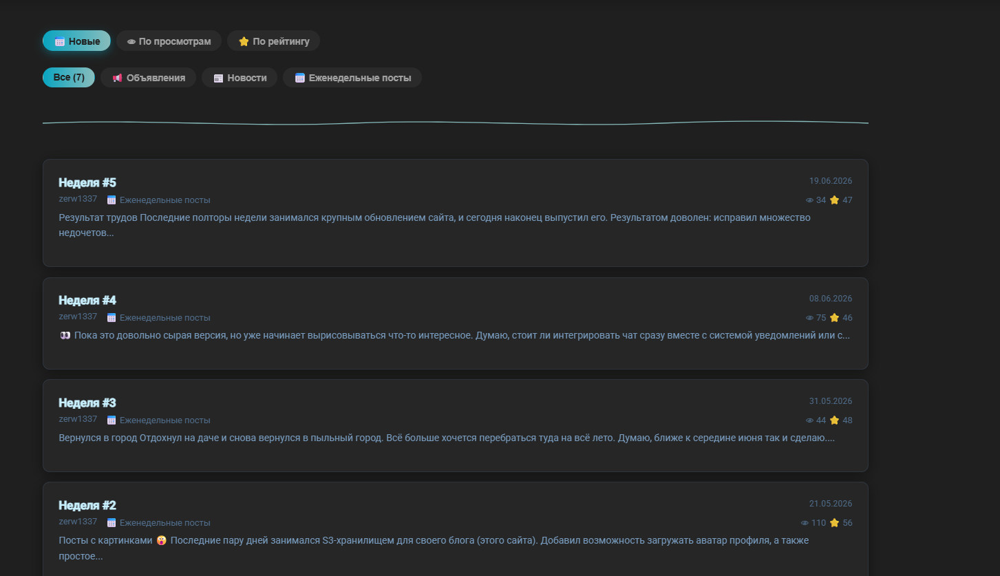
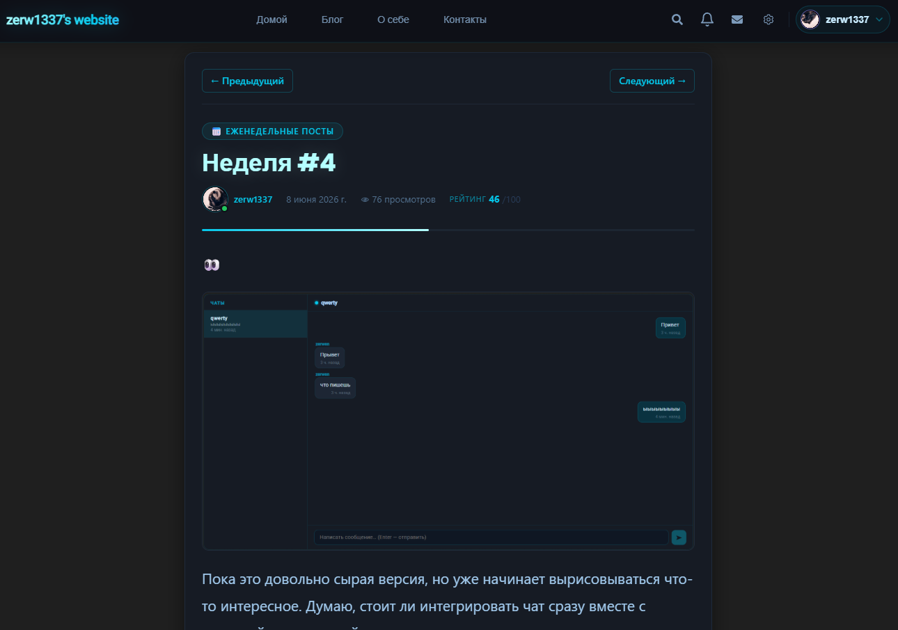
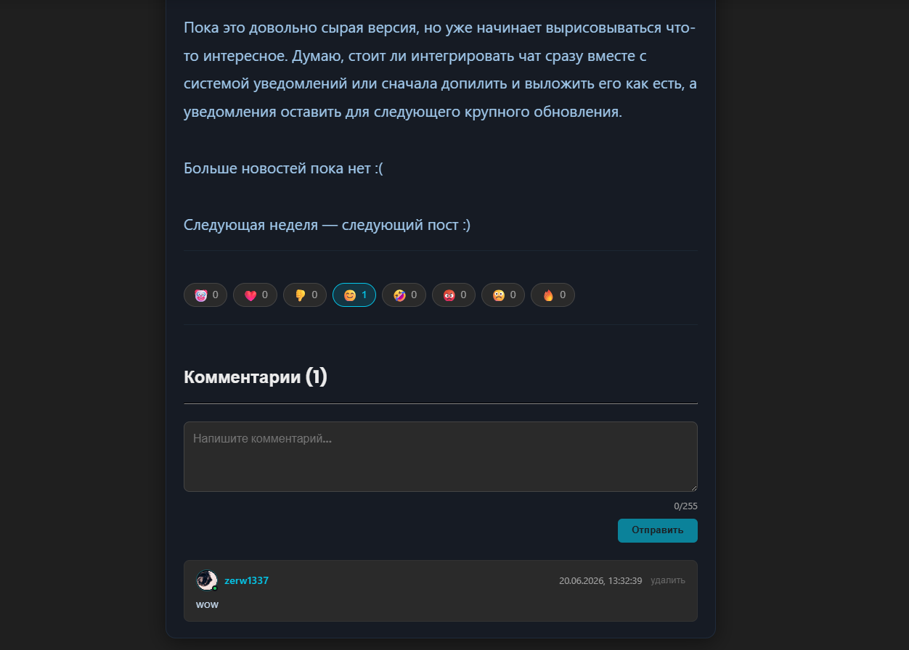
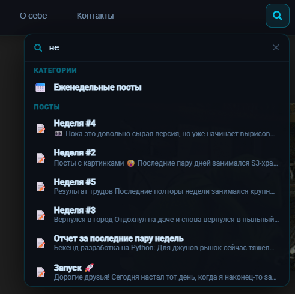
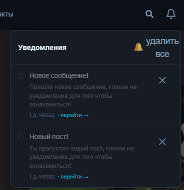
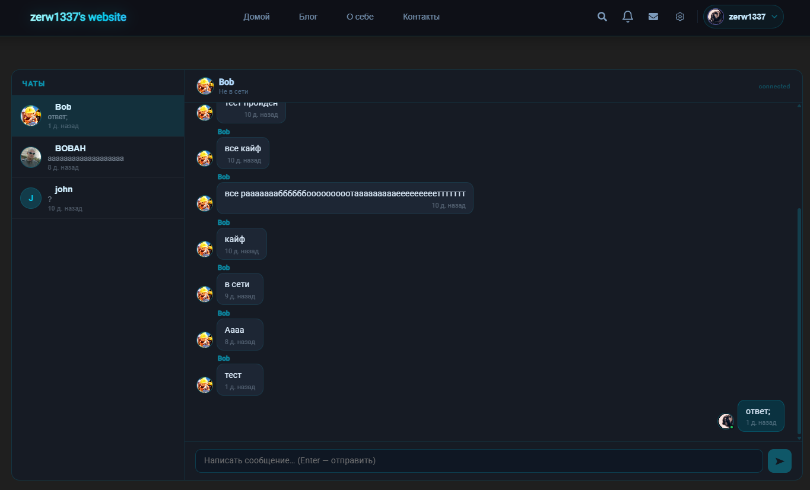
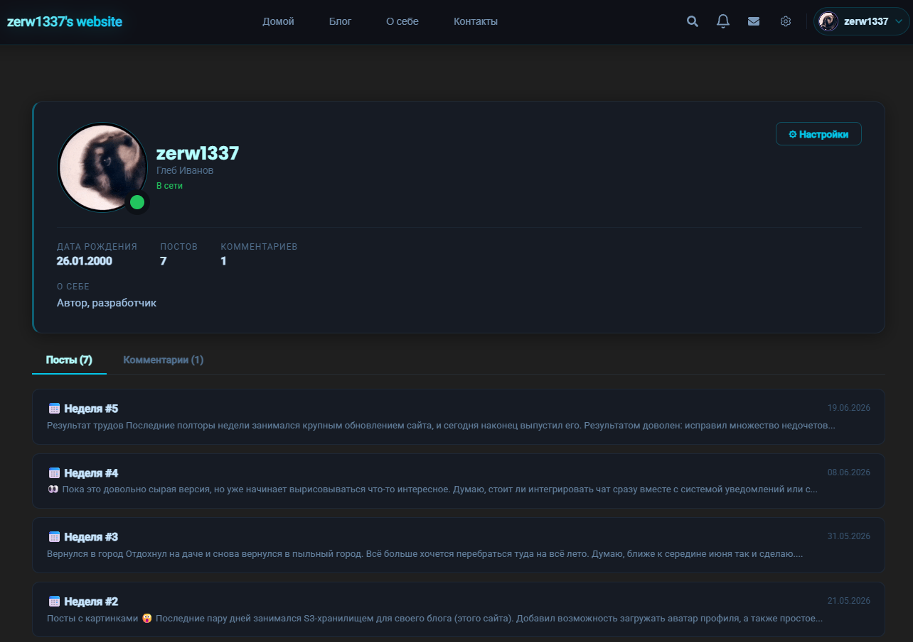

# my-simple-website

Минималистичный веб-блог с базовым функционалом социальной сети.
Фронтенд реализован преимущественно для демонстрации возможностей API.  
[Задеплоенный проект](https://zerw1337.ru)

## 🚀 Скриншоты  
<details>
  
  
    
  
  
  
  
  
 
  
 
  
 
  
 

</details>
---

## 🚀 Функционал

- 🔐 Аутентификация и авторизация на основе JWT (RS256)
- 👤 Личные профили пользователей
- 🟢 Система отслеживания онлайн-статуса через WebSocket
- 💬 Чаты 1×1 в реальном времени через WebSocket
- 🔔 Система уведомлений в реальном времени через WebSocket (новые сообщения, комментарии, посты, пользовательские уведомления)
- 📝 Блог-платформа: посты с медиафайлами, категории, комментарии, реакции, рейтинг, счетчик просмотров и пагинация
- 🚦 Redis Rate Limiting для защиты API от спама, brute-force атак и чрезмерной нагрузки
- 📧 SMTP-отправка писем для подтверждения действий и повышения безопасности учетных записей
- 🗄️ Хранение медиафайлов и других объектов в MinIO (S3-compatible storage)
- 🔍 Prefix Search для поиска пользователей, постов и категорий

## 🛠 Стек
- Backend: Python (FastAPI)
- WebSocket-соединения для обмена данными в реальном времени
- Frontend: React, Vite
- Database: PostgreSQL (asyncpg), Alembic
- S3: MinIO
- Validation: pydantic
- Cache & Rate Limit: Redis
- Auth: JWT (RS256)
- Email: SMTP (aiosmtplib)
- Deploy: Nginx, Docker
- Tests: Pytest

## ⛩️ Архитектура
<details>  

### Монолитное REST API, разделенное по слоям
Request → Route → DTO validation → Service → ORM → Response DTO → Response

### Дополнительно
- Alembic миграции
- Обработка ошибок
- Транзакции

</details>

## 📖 Docs
<details>  

Локально при запуске dev версии
- http://127.0.0.1:8000/docs  

Задеплоенная версия
- https://zerw1337.ru/api/docs

</details>

## ⚙️ Установка и запуск

<details>


### Клонирование

```bash
git clone https://github.com/zerw1337/my-simple-website.git
cd my-simple-website
```

### Генерация сертификатов

```bash
mkdir certs
cd certs

openssl genpkey -algorithm RSA -out private.pem -pkeyopt rsa_keygen_bits:2048
openssl rsa -pubout -in private.pem -out public.pem
```

### Запуск

```bash
docker compose -f docker-compose.dev.yml up --build --watch
```

</details>  